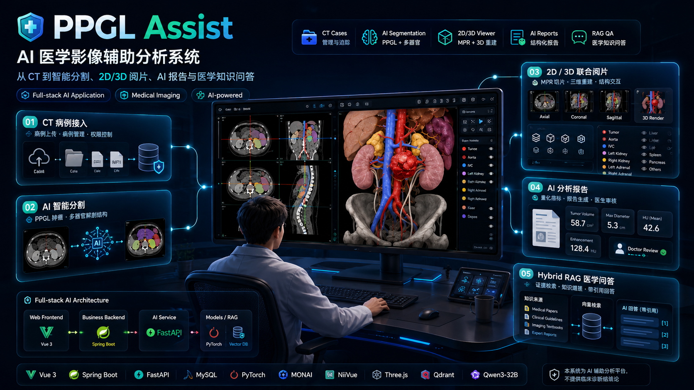

<h1 align="center">MedVision AI Workbench</h1>

<p align="center">
  面向 CT 与 MRI 场景的医学影像智能分析工作站
</p>

<p align="center">
  <b>CT/MRI 统一病例管理</b> · <b>全器官分割</b> · <b>PPGL 肿瘤分割</b> · <b>脑胶质瘤分割</b> · <b>2D/3D 阅片</b> · <b>AI 报告</b>
</p>

<p align="center">
  <a href="#项目简介">项目简介</a> ·
  <a href="#主要功能">主要功能</a> ·
  <a href="#快速开始">快速开始</a> ·
  <a href="#docker-compose-部署">Docker Compose 部署</a> ·
  <a href="#使用说明">使用说明</a> ·
  <a href="#医学知识库与证据面板">知识库与证据</a> ·
  <a href="#模型与数据">模型与数据</a> ·
  <a href="#质量保障">质量保障</a> ·
  <a href="#部署与安全">部署与安全</a>
</p>

<p align="center">
  
</p>

## 项目简介

MedVision AI Workbench 以统一病例中心为入口，在同一界面管理 CT 和 MRI 病例，并提供两条相互独立的影像分析工作流：

- **PPGL CT 工作流**：分别执行全器官分割和 PPGL 肿瘤分割，查看量化指标、二维/三维结果和联合阅片，并生成结构化 AI 辅助报告。
- **脑胶质瘤 MRI 工作流**：上传 FLAIR、T1、T1CE 和 T2 四个配准后序列，执行脑胶质瘤分割，查看 ED、NET、ET、TC 和 WT 定量指标、二维叠加结果和三维肿瘤模型。

系统还提供 PPGL 医学知识检索与病例报告问答功能。

系统的主要操作界面面向医生使用。患者端提供已审核报告查看与反馈原型，管理员角色用于权限区分。

> 本项目用于科研与教学场景的原型验证，不提供临床诊断结论。公开仓库不包含真实临床影像、患者隐私数据或模型权重。

## 主要功能

| 功能 | 使用说明 |
| --- | --- |
| 统一病例管理 | 在同一列表中管理 CT 和 MRI 病例，支持类型筛选、编号搜索、状态跟踪、查看结果、删除病例和重试失败任务。 |
| 全器官分割 | 对 CT 中的主要解剖结构进行自动分割，生成结构标签、体积指标和三维模型。 |
| PPGL 肿瘤分割 | 使用独立的 PPGL 分割模型生成肿瘤掩膜、体积、最大径和三维肿瘤模型。该任务不依赖全器官分割结果。 |
| 脑胶质瘤分割 | 校验四序列 MRI 的 shape、spacing、方向和 affine，然后生成水肿 ED、非增强肿瘤 NET 和增强肿瘤 ET 分割结果。 |
| 2D/3D 阅片 | CT 病例支持器官与 PPGL 肿瘤联合阅片；MRI 病例支持三个方向逐层查看与 ED、NET、ET 三维显示。 |
| AI 辅助报告 | 根据病例分割结果和量化指标，按照固定结构生成辅助分析报告。 |
| 报告问答 | 围绕当前病例报告继续提问，并通过流式输出查看回答。 |
| 医学知识库与证据面板 | 查看知识文献、切块和本地索引状态；基于检索证据生成带引用的回答，并查看 20 题脱敏评测结果。 |
| 访问控制 | 通过登录认证、角色权限和病例归属限制病例、影像与报告的访问范围。 |

全器官分割和 PPGL 肿瘤分割是两个独立 CT 功能。脑胶质瘤分割是独立的 MRI 工作流，不会调用或改变 CT 病例的分析结果。

## 典型使用流程

### PPGL CT 工作流

1. 使用医生账号登录系统。
2. 上传 `.nii.gz` 格式的 CT 影像并创建病例。
3. 在病例详情页按需启动“全器官分割”或“PPGL 肿瘤分割”。
4. 等待任务状态显示“全器官分割完成”或“PPGL：肿瘤分割完成”。
5. 查看分割指标、二维切片和三维模型；两个任务均完成后可进行联合阅片。
6. 生成结构化 AI 辅助报告，并围绕报告内容继续问答。

### 脑胶质瘤 MRI 工作流

1. 在“上传病例”菜单中选择“上传 MRI”。
2. 分别选择 FLAIR、T1、T1CE 和 T2 四个 `.nii.gz` 文件。
3. 完成上传后执行四序列空间一致性校验。
4. 校验通过后启动脑胶质瘤分割。
5. 在结果页查看 WT、TC、ET、ED 体积、最大三维径和病灶数量。
6. 在轴位、冠状位和矢状位查看逐层叠加结果，并独立切换 ED、NET 和 ET 三维模型。

## 运行前准备

推荐在 Linux 环境中运行。完整 AI 推理建议使用支持 CUDA 的 NVIDIA GPU。

需要提前安装：

- JDK 21（必须是 JDK，不能只有 JRE）
- Maven
- MySQL 8.x
- Node.js 20 或更高版本、npm
- Conda
- Ollama，或其他兼容 OpenAI API 的本地大模型服务

可以先检查基础环境：

```bash
java -version
javac -version
mvn -version
mysql --version
node --version
npm --version
conda --version
ollama --version
```

完整推理还需要：

- PPGL 分割权重
- 脑胶质瘤分割权重
- 全器官分割所需权重
- 已授权并完成脱敏的 CT 或四序列 MRI 测试影像

## 快速开始

以下命令以 Ubuntu/Linux 和单机运行环境为例。

### 1. 获取项目

```bash
git clone https://github.com/ChangjinHe2000/medvision-ai-medical-imaging.git
cd medvision-ai-medical-imaging
```

### 2. 安装项目依赖

创建 Python 推理环境：

```bash
conda env create -f envs/environment.inference.yml
conda activate ppgl
```

安装 Vue 前端依赖：

```bash
cd frontend-vue-prototype
npm ci
cd ..
```

Spring Boot 依赖会在首次执行 Maven 启动命令时自动下载。

### 3. 初始化 MySQL 数据库

先进入 MySQL 管理终端。Ubuntu 默认安装通常可以使用：

```bash
sudo mysql
```

如果你的 MySQL root 账号使用密码登录，则改用 `mysql -u root -p`。

在 MySQL 中创建项目数据库和专用账号；请将示例密码替换为自己的强密码：

```sql
CREATE DATABASE IF NOT EXISTS ppgl_analyze
  CHARACTER SET utf8mb4
  COLLATE utf8mb4_unicode_ci;

CREATE USER IF NOT EXISTS 'ppgl_app'@'127.0.0.1'
  IDENTIFIED BY 'replace_with_a_strong_password';

GRANT ALL PRIVILEGES ON ppgl_analyze.*
  TO 'ppgl_app'@'127.0.0.1';

FLUSH PRIVILEGES;
EXIT;
```

导入数据表：

```bash
mysql -h 127.0.0.1 -u ppgl_app -p ppgl_analyze \
  < frontend-javaweb/src/main/resources/schema.sql
```

### 4. 配置运行参数

复制配置模板：

```bash
cp .env.example .env
```

编辑 `.env`，至少确认以下配置：

| 配置项 | 作用 | 本地示例 |
| --- | --- | --- |
| `PPGL_DATA_ROOT` | 保存病例、日志、RAG 索引和运行结果 | `$HOME/ppgl-assist-data` |
| `MYSQL_HOST` | MySQL 地址 | `127.0.0.1` |
| `MYSQL_DATABASE` | 数据库名称 | `ppgl_analyze` |
| `MYSQL_USER` | 数据库账号 | `ppgl_app` |
| `MYSQL_PASSWORD` | 数据库密码 | 第 3 步设置的密码 |
| `PPGL_AUTH_JWT_SECRET` | 登录令牌签名密钥 | 至少 32 个随机字符 |
| `PPGL_INTERNAL_API_KEY` | 业务后端访问 AI 服务的内部密钥 | 强随机字符串 |
| `TOTALSEG_WEIGHTS_PATH` | 全器官分割权重目录 | `$HOME/.totalsegmentator/nnunet/results` |
| `PPGL_V5_CHECKPOINT` | PPGL 分割权重文件（可选覆盖） | `weights/model_best.pth` 或绝对路径 |
| `PPGL_GLIOMA_ENABLED` | 是否启用脑胶质瘤分割 | `true` |
| `PPGL_GLIOMA_MODEL_DIR` | 脑胶质瘤模型目录，相对路径从 `PPGL_DATA_ROOT` 解析 | `models/brain-glioma/nnUNetTrainer__nnUNetPlans__3d_fullres` |
| `PPGL_GLIOMA_DEVICE` | 脑胶质瘤推理设备 | `cuda` |
| `PPGL_GLIOMA_MAX_UPLOAD_MB` | 单个 MRI 序列最大上传大小 | `2048` |

可以执行两次下面的命令，分别生成 JWT 密钥和内部 API 密钥：

```bash
openssl rand -hex 32
```

真实 `.env` 已被 Git 排除，不要将其中的密码或密钥上传到公开仓库。

### 5. 准备模型

将 PPGL 分割权重放到默认位置：

```text
ai-backend/progress_patch_v5/weights/model_best.pth
```

也可以在 `.env` 中通过 `PPGL_V5_CHECKPOINT` 指定其他位置。该权重暂不随仓库发布，后续将上传至 Hugging Face，并在本文档中补充下载地址。

全器官分割首次运行时可能需要下载模型权重。请确保 `TOTALSEG_WEIGHTS_PATH` 指向当前用户可读写的目录，并保持网络可用。

将脑胶质瘤分割权重放在仓库外的模型目录。默认结构为：

```text
$PPGL_DATA_ROOT/models/brain-glioma/
└── nnUNetTrainer__nnUNetPlans__3d_fullres/
    ├── dataset.json
    ├── plans.json
    ├── model_manifest.json
    └── fold_0/
        └── checkpoint_best.pth
```

准备完成后在 `.env` 中启用：

```dotenv
PPGL_GLIOMA_ENABLED=true
PPGL_GLIOMA_MODEL_DIR=models/brain-glioma/nnUNetTrainer__nnUNetPlans__3d_fullres
PPGL_GLIOMA_DEVICE=cuda
```

脑胶质瘤权重暂不随代码仓库发布，后续将上传至 Hugging Face 并在本文档补充下载地址。当前权重用于科研原型验证，不作为独立临床结论或性能承诺。

AI 报告和问答需要可用的本地模型。推荐使用 Ollama：`qwen3:8b` 用于医学知识问答，`qwen3:32b` 用于报告问答和解释性任务，`bge-m3` 用于知识库检索向量。

```bash
ollama pull qwen3:8b
ollama pull qwen3:32b
ollama pull bge-m3
```

随后在 `.env` 中加入或修改：

```dotenv
RAG_OPENAI_MODEL=qwen3:8b
CHAT_OPENAI_MODEL=qwen3:32b
REPORT_OPENAI_MODEL=qwen3:32b
PPGL_EMBEDDING_PROVIDER=ollama
PPGL_EMBEDDING_OLLAMA_MODEL=bge-m3
```

### 6. 启动全部服务

打开第一个终端，在项目根目录启动 Ollama、FastAPI 和 Vue：

```bash
sudo systemctl start mysql

set -a
source .env
set +a

bash ai-backend/start_ppgl_ai.sh
```

看到 FastAPI 运行在 `8000` 端口、Vue 运行在 `5173` 端口后，打开第二个终端启动 Spring Boot：

```bash
set -a
source .env
set +a

export JAVA_HOME=/usr/lib/jvm/java-21-openjdk-amd64
export PATH="$JAVA_HOME/bin:$PATH"

cd frontend-javaweb
mvn spring-boot:run
```

服务启动完成后访问：

```text
http://127.0.0.1:5173/
```

### 7. 首次初始化医生账号

项目不提供固定的默认账号和密码。第一次打开 `http://127.0.0.1:5173/` 时，登录页会自动显示初始化表单，请填写账号、医生姓名、手机号和密码。

提交成功后，系统会创建第一个医生账号并自动登录。初始化入口随后自动关闭，以后打开系统只会显示正常登录页面。公开注册仍然只能创建患者账号，不能自行注册为医生。

## Docker Compose 部署

Docker Compose 会启动 MySQL、AI 推理服务、Java 业务后端、Vue Web 界面和本地 Ollama 服务。浏览器只访问 Web 界面；MySQL 与 AI 推理服务保持在内部网络中。

部署主机需要安装 Docker Engine、Docker Compose v2 和 NVIDIA Container Toolkit。GPU 推理容器需要能正常执行 `nvidia-smi`。

### 1. 准备仓库外的数据和模型目录

```text
/opt/medvision-data/       # 病例、日志、RAG 索引、任务队列和运行结果
/opt/medvision-data/models/brain-glioma/nnUNetTrainer__nnUNetPlans__3d_fullres/  # 可选
/opt/medvision-models/
├── ppgl/weights/model_best.pth
└── totalsegmentator/nnunet/results/
```

真实病例、数据库、模型权重和日志均不会写入代码仓库。

### 2. 配置环境变量

```bash
cp .env.example .env
```

编辑 `.env`，至少填写以下值：

```dotenv
PPGL_HOST_DATA_ROOT=/opt/medvision-data
PPGL_HOST_MODEL_ROOT=/opt/medvision-models
MYSQL_USER=ppgl_app
MYSQL_PASSWORD=替换为数据库强密码
MYSQL_ROOT_PASSWORD=替换为 MySQL root 强密码
PPGL_AUTH_JWT_SECRET=替换为至少 32 位随机字符串
PPGL_INTERNAL_API_KEY=替换为内部服务随机密钥
RAG_OPENAI_MODEL=qwen3:8b
CHAT_OPENAI_MODEL=qwen3:32b
REPORT_OPENAI_MODEL=qwen3:32b
PPGL_EMBEDDING_OLLAMA_MODEL=bge-m3
```

可分别执行两次 `openssl rand -hex 32` 生成登录密钥和内部服务密钥。需要启用脑胶质瘤分割时，将 `PPGL_GLIOMA_ENABLED` 设为 `true`。

### 3. 启动与检查

```bash
docker compose up -d --build
docker compose ps
```

首次使用需要下载对话模型和知识库检索模型：

```bash
docker compose exec ollama ollama pull qwen3:8b
docker compose exec ollama ollama pull qwen3:32b
docker compose exec ollama ollama pull bge-m3
```

确认向量模型可由 AI 服务调用：

```bash
docker compose exec ai python -c \
'from rag.embedding_service import encode_texts; print(encode_texts(["RAG 向量模型测试"], batch_size=1).shape)'
```

输出 `(1, 1024)` 表示向量模型可用。全部服务显示 `healthy` 后，访问 `http://127.0.0.1:5173/`。首次访问会显示医生账号初始化表单。

查看服务日志或停止服务：

```bash
docker compose logs -f ai
docker compose down
```

## 使用说明

### 上传病例

1. 使用医生账号登录后，在“上传病例”菜单中选择“上传 CT”或“上传 MRI”。
2. CT 工作流上传一个 `.nii.gz` 影像；MRI 工作流分别上传 FLAIR、T1、T1CE 和 T2 四个 `.nii.gz` 序列。
3. MRI 四序列必须已完成配准，并通过系统的 NIfTI Header 和空间一致性校验。
4. 上传完成后系统会生成病例编号，所有 CT 和 MRI 病例都在同一个病例管理页面中显示。

### 执行分割

CT 病例提供两个独立任务：

- “全器官分割”生成器官掩膜、器官体积和三维结构。
- “PPGL 肿瘤分割”生成 PPGL 肿瘤掩膜、体积、最大径和三维肿瘤结构。

两个 CT 任务可以分别运行，互不绑定。MRI 病例通过独立的脑胶质瘤分割任务处理。任务失败后可以在统一病例管理页面重新尝试分割。

### 查看结果

- CT 病例可查看全器官和 PPGL 分割进度、量化指标、二维叠加图和三维结构。
- 全器官和 PPGL 两类分割都完成后，可同时加载器官与肿瘤进行联合阅片。
- MRI 病例可查看 WT、TC、ET、ED 等定量指标，以及轴位、冠状位和矢状位逐层叠加结果。
- MRI 三维视图支持独立切换水肿 ED、非增强肿瘤 NET 和增强肿瘤 ET。

### 生成 AI 报告

CT 分割完成后可进入报告页面生成结构化 AI 辅助报告。报告按照固定章节组织，病例数据和量化结果会填入对应位置。报告仅供辅助参考，使用者应结合原始影像和专业判断进行复核。

### 病例管理

病例管理页面统一显示 CT 和 MRI 病例，并支持全部/CT/MRI 筛选、病例编号搜索、状态跟踪、查看结果、继续上传、重试失败任务和删除病例。CT 和 MRI 各自使用独立的后端工作流，不会相互覆盖原始影像或分割结果。

删除病例会同时移除对应的原始影像和运行结果，操作前请确认不再需要这些数据或已经完成备份。

## 可选：启用医学知识问答

RAG 知识库不是影像分割的必需条件。需要使用医学知识检索和问答时，再执行以下初始化操作。

Docker Compose 部署使用 Ollama 的本地 `bge-m3` 向量模型。完成上方的 `ollama pull bge-m3` 后，在项目根目录执行：

```bash
docker compose exec ai mkdir -p \
  /var/lib/ppgl-assist/rag-documents \
  /var/lib/ppgl-assist/rag-parsed \
  /var/lib/ppgl-assist/rag-index

docker compose exec ai sh -c \
'cp -n /app/ai-backend/knowledge_base/documents/* /var/lib/ppgl-assist/rag-documents/'

docker compose exec ai python -m rag.build_chunks \
  --documents /var/lib/ppgl-assist/rag-documents \
  --output /var/lib/ppgl-assist/rag-parsed/chunks.jsonl

docker compose exec ai python -m rag.build_index --batch-size 8
```

构建完成后会在仓库外的数据目录创建 Qdrant 本地索引。索引已经存在时无需重复执行；补充或替换知识文档后再重新构建即可。

## 医学知识库与证据面板

登录后进入“PPGL 医学知识库”，可以在同一页面完成知识问答、检索证据复核和知识库状态查看：

1. 顶部“知识库资产与评测”显示当前已纳入的文献数、切块数、向量索引数量、向量模型和索引状态。
2. 展开“文献来源与切块清单”可查看每篇文献的来源编号、年份、切块数量和原始公开来源链接。
3. 展开“20 题检索与引用评测”可查看不同评测版本的检索命中率、目标文献引用率、有效引用率和逐题耗时；“用于问答”可将某道脱敏评测问题填入问答框复核当前结果。
4. 发起问答后，右侧“检索证据”会列出实际参与回答的文献片段、相关度与来源链接；回答区会显示引用覆盖和证据提示。

评测数据用于比较知识库和检索配置的工程质量，不构成临床性能结论。补充或替换文献后，需要按上一节的初始化命令重新构建切块与索引，再在页面点击“刷新状态”。

## 模型与数据

公开仓库不包含以下资产：

- PPGL 分割权重
- 脑胶质瘤分割权重
- 全器官分割权重
- 真实医学影像
- 数据库内容、上传文件、日志和推理结果
- 本地大模型文件和私有配置

运行数据默认保存在 `~/ppgl-assist-data`。通过 `PPGL_DATA_ROOT` 可以改为其他项目外目录，推荐结构如下：

```text
$PPGL_DATA_ROOT/
├── uploads/         # 业务后端接收的上传文件
├── jobs/            # 分析任务状态与中间结果
├── cases/           # CT 病例工作区和推理结果
├── brain-cases/     # 脑胶质瘤 MRI 病例与推理结果
├── models/
│   └── brain-glioma/ # 脑胶质瘤分割权重
├── logs/            # 服务日志
├── rag-documents/   # RAG 原始文档
├── rag-parsed/      # RAG 切块结果
└── rag-index/       # Qdrant 本地向量索引
```

请只使用已获得授权且完成脱敏的测试影像。模型与数据的补充说明见 [WEIGHTS_AND_DATA.md](WEIGHTS_AND_DATA.md)。

## 质量保障

项目在提交新版本时会自动完成以下检查，以降低安装、登录、接口调用和前端构建出现基础问题的概率：

- **服务测试**：验证 AI 服务的运行记录隐私保护与访问隔离，以及业务后端的启动和未登录接口访问控制。
- **构建校验**：检查 Python 服务语法、Java 后端测试和 Vue 生产构建，确保三个服务可以正常编译或构建。
- **公开仓库保护**：扫描密钥和敏感文件，防止 `.env`、数据库、真实医学影像和模型权重被意外提交。

自动检查用于保障软件交付质量，不能替代医学影像结果复核、临床验证或数据合规审查。

## 部署与安全

本地体验可以直接使用上述启动方式。服务器部署推荐使用单机或内网环境，并遵循以下配置：

- Docker Compose 部署只公开 Web 入口；MySQL、Java 和 AI 服务不会映射到宿主机端口。
- 使用 Nginx 托管前端构建产物，将 `/api` 请求转发到 Spring Boot。
- 仅向使用者开放 Web 入口，FastAPI 和 MySQL 保持在本机或内网。
- 为 `PPGL_AUTH_JWT_SECRET`、`PPGL_INTERNAL_API_KEY` 和数据库账号设置独立的强密码。
- 将病例、数据库、模型、日志和运行结果放在代码仓库之外，并定期备份。
- 不要把 `.env`、真实病例、患者信息或模型权重上传到公开仓库。
- 确保服务运行账号对数据目录和模型目录具有所需的读写权限。

常用服务器配置示例：

| 配置项 | 示例 |
| --- | --- |
| `PPGL_DATA_ROOT` | `/var/lib/ppgl-assist` |
| `MYSQL_HOST` | MySQL 内网地址 |
| `PPGL_PIPELINE_BASE_URL` | `http://ai-service:8000` |
| `VITE_API_PROXY_TARGET` | `http://java-service:8080` |
| `CHAT_OPENAI_BASE_URL` | 内网大模型服务地址 |

## 常见问题

### Maven 提示没有编译器

这表示当前使用的是 JRE，或 `JAVA_HOME` 没有指向 JDK 21。确认以下两个命令都能正常输出版本：

```bash
java -version
javac -version
```

Ubuntu 的 JDK 21 常见配置为：

```bash
export JAVA_HOME=/usr/lib/jvm/java-21-openjdk-amd64
export PATH="$JAVA_HOME/bin:$PATH"
```

### 分割失败后在哪里查看日志

服务日志位于：

```text
$PPGL_DATA_ROOT/logs/
```

每个病例的分割日志和错误信息位于：

```text
CT:  $PPGL_DATA_ROOT/cases/<病例编号>/
MRI: $PPGL_DATA_ROOT/brain-cases/<病例编号>/
```

修正模型路径、显存或依赖问题后，可以在病例管理页面重新尝试失败的任务。

### 页面可以打开，但无法登录或调用接口

请确认 Spring Boot 已运行在 `8080` 端口，Vue 的 `VITE_API_PROXY_TARGET` 指向该地址。全新数据库会显示首次初始化表单；已经完成初始化的数据库需要使用现有账号登录。

## 系统组成

```text
浏览器（Vue，5173）
  └─ 病例操作、结果查看与报告交互
       ↓ /api
Spring Boot（8080）
  └─ 登录认证、角色与病例权限、业务数据、AI 请求转发
       ↓ 内部 API
FastAPI（8000）
  └─ 全器官分割、PPGL 肿瘤分割、脑胶质瘤分割、三维产物、RAG 与 AI 报告
```

主要目录：

```text
.
├── frontend-vue-prototype/  # Vue Web 界面
├── frontend-javaweb/        # Spring Boot 业务后端与患者端原型
├── ai-backend/              # FastAPI、分割推理、RAG 和报告服务
├── envs/                    # Conda 环境配置
├── docs/                    # 补充说明与图片资源
└── WEIGHTS_AND_DATA.md      # 模型权重和医学数据说明
```
